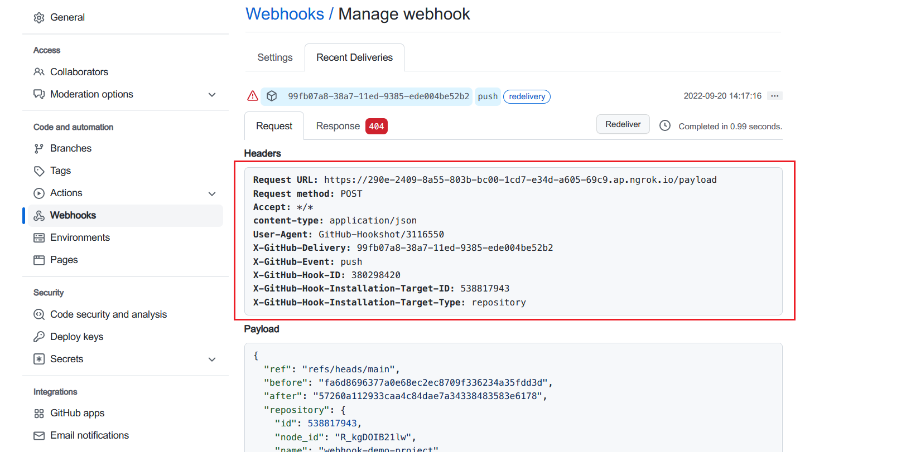
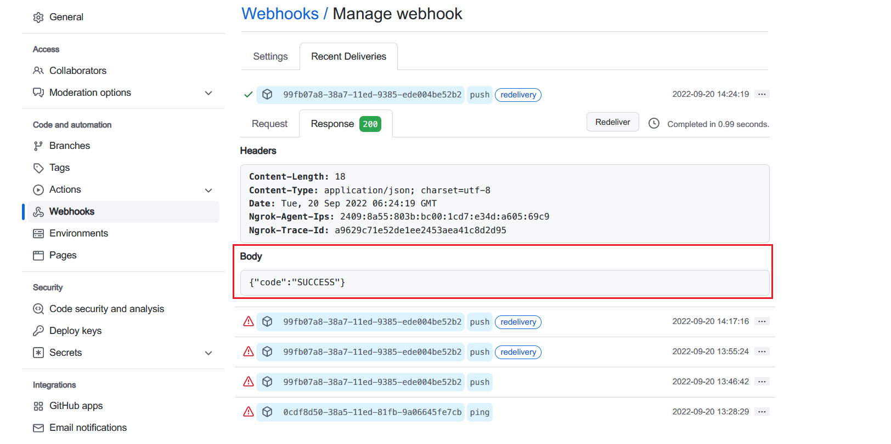

# webhook-demo-project
A demo project for learning github webhook.

## Get start
1. New a git project like this demo project in GitHub.
2. download ngrok and run it to expose a certain port in your local PC. In this demo, the port is 4567.
3. In your project, Go to `Settings` -> `Webhooks` -> `new webhook`, enter input similar to the following format:
```
- Payload URL: https://290e-2409-8a55-803b-bc00-1cd7-e34d-a605-69c9.ap.ngrok.io/payload
- Content type: application/json
- Secret(Optional): [Leave it blank for now]
- Enable SSL verification 
- Which events would you like to trigger this webhook? => Just the push event.
- Active(We will deliver event details when this hook is triggered.)
```
Then save it.
4. Start `server.js` in your local PC.
5. Use git command to commit and push something to GitHub. Then you can see something in `server.js` console.
```bash
{
  request: {
    method: 'POST',
    url: '/payload',
    header: {
      host: '290e-2409-8a55-803b-bc00-1cd7-e34d-a605-69c9.ap.ngrok.io',
      'user-agent': 'GitHub-Hookshot/3116550',
      'content-length': '7648',
      accept: '*/*',
      'content-type': 'application/json',
      'x-forwarded-for': '140.82.115.109',
      message: 'Not Found',
      header: [Object: null prototype] {}
    },
    app: { subdomainOffset: 2, proxy: false, env: 'development' },
    originalUrl: '/payload',
    req: '<original node req>',
    res: '<original node res>',
    socket: '<original node socket>'
  }
}
```
6. Go to the webhook page of this project. We can see more detail about webhook request and response


The request looks fine, but why the response has a red 404 tag?

Notice we have not  send response to GitHub webhooks before.

So we should change our `server.js` to follow:
```js
router
    .post('/payload', (ctx, next) => {
        console.log(ctx);

        // response json
        ctx.body = { 'code': 'SUCCESS'}
    })
```
And restart `server.js`. Then we repeat a push to GitHub.

Now we can see everything works well.


## Do better
- setup webhook secret to avoid other traffic attack.
- use pm2 to manage `server.js` life cycle.
